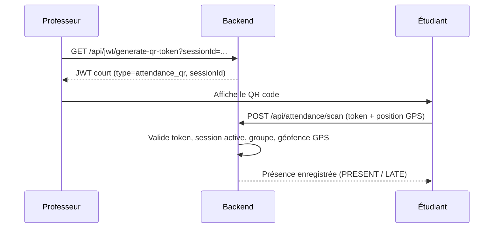

<div align="center">

# 📋 Presence App

**Application de gestion de présence universitaire par QR code dynamique**

Backend **Spring Boot** · Frontend **Flutter** · Auth **JWT** · Géolocalisation **GPS**

</div>

---

## ✨ Aperçu

**Presence App** permet de marquer la présence en cours via un **QR code dynamique** dans un contexte universitaire (ENSAM Casablanca). Le professeur génère un QR code pour sa session, l'étudiant le scanne, et sa présence est enregistrée automatiquement avec validation **GPS** et **règle de retard**.

Deux parcours distincts :

| 👨‍🏫 Professeur | 👨‍🎓 Étudiant |
|---|---|
| Gestion des cours | Scan de QR code |
| Création & fermeture de sessions | Enregistrement de présence |
| Affichage du QR dynamique | Historique personnel filtré |
| Suivi des présences | Dashboard de statistiques |

---

## 🏗️ Architecture

```
┌─────────────────────┐         ┌──────────────────────┐
│      Flutter        │  REST   │     Spring Boot      │
│  (mobile / web)     │ ──────► │   (API + logique)    │
│                     │  JSON   │                      │
│  • Scan QR          │ ◄────── │  • Auth JWT          │
│  • Dashboards       │         │  • Sessions          │
│  • Formulaires      │         │  • Présences         │
└─────────────────────┘         │  • Géofence GPS      │
                                └──────────┬───────────┘
                                           │ JPA
                                ┌──────────▼───────────┐
                                │  H2 (dev uniquement) │
                                └──────────────────────┘
```

- **Frontend** : Flutter consomme une API REST JSON.
- **Backend** : Spring Boot applique la logique métier et persiste en **H2** *(base embarquée réservée au développement)*.
- **Authentification** : JWT (access + refresh).
- **QR de présence** : JWT court dédié à une session (durée 2 min).

---

## 🛠️ Stack technique

### Backend (`backend/`)
| Technologie | Usage |
|---|---|
| Java 17 | Langage |
| Spring Boot | Framework |
| Spring Web MVC | API REST |
| Spring Data JPA | Persistance |
| Spring Security | Authentification |
| H2 | Base de données *(dev uniquement)* |
| JJWT | Génération / validation des tokens |
| ModelMapper | Mapping DTO |
| BCrypt | Hachage des mots de passe |

### Frontend (`frontend/`)
| Technologie | Usage |
|---|---|
| Dart / Flutter | Framework UI |
| `http` | Appels API |
| `shared_preferences` | Stockage local des tokens |
| `get` (GetX) | Navigation & état |
| `mobile_scanner` | Scan de QR code |
| `qr_flutter` | Affichage de QR code |
| `jwt_decode` | Décodage du rôle depuis le JWT |

---

## 🔐 Sécurité

- **Mots de passe** hachés avec **BCrypt**.
- **JWT access** (15 min) + **refresh** (7 jours).
- **QR de présence** : JWT court (2 min) avec `type=attendance_qr` et `sessionId`.
- **Secrets externalisés** via variables d'environnement :
  - `JWT_SECRET_KEY`
  - `MAIL_USERNAME` / `MAIL_PASSWORD`
  - `CORS_ALLOWED_ORIGINS`
- **Contrôle d'accès** par rôle (PROFESSOR / STUDENT / ADMIN).
- **Géofence GPS** : validation de la position de l'étudiant par distance Haversine.

---

## 📦 Installation & exécution

### Prérequis
- **Java 17+**
- **Maven** (ou wrapper fourni)
- **Flutter SDK**
- Android Studio / Xcode (selon la cible)

### 1. Lancer le backend

Depuis le dossier `backend/` :

```powershell
.\mvnw.cmd spring-boot:run
```

Le backend démarre sur `http://localhost:8080`.

> **Variables d'environnement optionnelles** (avec valeurs par défaut si absentes) :
> ```powershell
> $env:JWT_SECRET_KEY="votre-secret-tres-long"
> $env:MAIL_USERNAME="votre-email@gmail.com"
> $env:MAIL_PASSWORD="votre-mot-de-passe-app"
> $env:CORS_ALLOWED_ORIGINS="http://localhost:3000,https://monsite.com"
> ```

> **⚠️ H2 est utilisé uniquement en développement.** En production, il faudra brancher une vraie base (PostgreSQL, MySQL…) via `spring.datasource.*`.

Console H2 (dev) : `http://localhost:8080/h2-console`

### 2. Lancer le frontend

Depuis le dossier `frontend/` :

```powershell
flutter pub get
flutter run
```

> **URL de l'API** selon la cible :
> - **Web** : `localhost`
> - **Émulateur Android** : `10.0.2.2`
> - **Mobile physique** : IP locale du PC (configurable dans `lib/config`)

---

## 🔑 Comptes de démonstration

Des données de test sont injectées automatiquement au premier démarrage du backend.

| Rôle | Email | Mot de passe |
|---|---|---|
| 👨‍🏫 Professeur | `prof1@ensam-casa.ma` … `prof6@ensam-casa.ma` | `prof1234` |
| 👨‍🎓 Étudiant | *(par groupe)* | `etudiant1234` |

---

## 📡 API principale

### Auth / JWT
| Méthode | Endpoint | Description |
|---|---|---|
| `POST` | `/api/auth/login` | Connexion |
| `POST` | `/api/jwt/refresh` | Rafraîchir le token |
| `GET` | `/api/jwt/generate-qr-token?sessionId={id}` | Générer le QR de session |

### Cours
| Méthode | Endpoint | Description |
|---|---|---|
| `GET` | `/api/courses?page={p}&size={s}` | Lister les cours |
| `POST` | `/api/courses` | Créer un cours |
| `DELETE` | `/api/courses/{id}` | Supprimer un cours |
| `GET` | `/api/courses/check-code?code={code}` | Vérifier l'unicité du code |

### Sessions
| Méthode | Endpoint | Description |
|---|---|---|
| `GET` | `/api/sessions?page={p}&size={s}` | Lister les sessions |
| `GET` | `/api/sessions/{id}` | Détail d'une session |
| `POST` | `/api/sessions` | Créer une session |
| `PUT` | `/api/sessions/{id}/close` | Fermer une session |
| `DELETE` | `/api/sessions/{id}` | Supprimer une session |

### Groupes
| Méthode | Endpoint | Description |
|---|---|---|
| `GET` | `/api/groups` | Lister les groupes |

### Présence
| Méthode | Endpoint | Description |
|---|---|---|
| `POST` | `/api/attendance/scan` | Scanner un QR & enregistrer |
| `GET` | `/api/attendance/my?period=...&status=...&search=...` | Historique + stats étudiant |

---

## 🧭 Flux QR professeur → étudiant



---

## 📁 Structure du repository

```
Presence/
├── backend/                  # API Spring Boot
│   ├── src/main/java/        # Code source
│   │   └── com/backend/backend/
│   │       ├── config/       # Sécurité, CORS
│   │       ├── dao/          # Entités & repositories
│   │       ├── dto/          # Objets de transfert
│   │       ├── service/      # Logique métier
│   │       └── web/          # Controllers REST
│   ├── src/main/resources/   # Config (application.properties)
│   └── pom.xml
├── frontend/                 # Application Flutter
│   └── lib/
│       ├── Api/              # Appels HTTP
│       ├── pages/            # Écrans (login, dashboards, scan)
│       ├── components/       # Widgets réutilisables
│       └── config/           # URL API & routes
└── README.md
```

---

## 🗺️ Roadmap

- [x] Authentification JWT (access + refresh)
- [x] Flux QR de présence de bout en bout
- [x] Création & fermeture de sessions (professeur)
- [x] Géofence GPS (distance Haversine)
- [x] Règle de retard (LATE après 10 min)
- [x] Vérification d'appartenance au groupe
- [x] Sécurité durcie (BCrypt, secrets, CORS)
- [ ] Feuille de présence complète par session
- [ ] Synchronisation hors-ligne (batch)
- [ ] Tests backend & frontend
- [ ] Déploiement (Docker / CI)

---

<div align="center">
  <sub>Projet étudiant — ENSAM Casablanca</sub>
</div>
